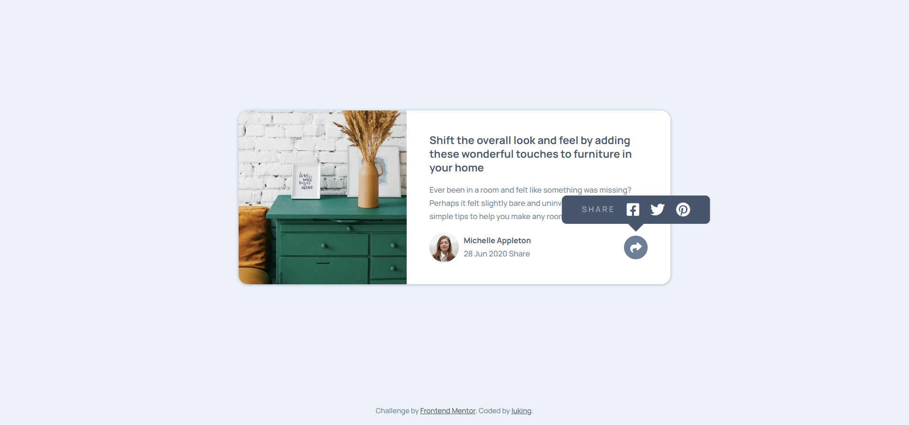

# Frontend Mentor - Article preview component solution

This is a solution to the [Article preview component challenge on Frontend Mentor](https://www.frontendmentor.io/challenges/article-preview-component-dYBN_pYFT). Frontend Mentor challenges help you improve your coding skills by building realistic projects. 


## 👀 Overview

### 🚩 The challenge

Users should be able to:

- View the optimal layout for the component depending on their device's screen size
- See the social media share links when they click the share icon

### 📸 Screenshot




### 🏡 Link

- Live Site URL: [Visit Online](https://luking-frontendmentor-challenges.netlify.app/article-preview-component/)

## 🚧 My process

### 🔖 Built with

- Semantic HTML5 markup
- CSS custom properties
- Flexbox
- CSS Grid
- Mobile-first workflow

### ✍️ What I learned
```css
.desktop-share-tooltip::after {
  content: "";
  position: absolute;
  bottom: 0;
  left: 50%;
  transform: translate(-50%, 100%);
  width: 1.7rem;
  height: 1.7rem;
  background-color: inherit;
  clip-path: polygon(0 0, 100% 0, 50% 50%);
}
```

```css
/* it's hard for me to figure out the article's share state at first, finally I made it.*/
.mobile-share-tooltip {
  /* on mobile unshare state as default */
  display: none;
}

.desktop-share-tooltip {
  /* on mobile unshare state as default */
  display: none;
}

/* on mobile article's share state */
.share .mobile-share-tooltip {
  display: flex;
}

/* for the desktop */
@media (min-width: 900px) {
  /* on desktop .mobile-share-tooltip should aways display none */
  article.article .mobile-share-tooltip {
    display: none;
  }

  /* on desktop article's share state */
  .share .desktop-share-tooltip {
    display: flex;
  }
}
```

### 🔗 Useful resources

- [clip path](https://developer.mozilla.org/en-US/docs/Web/CSS/clip-path)