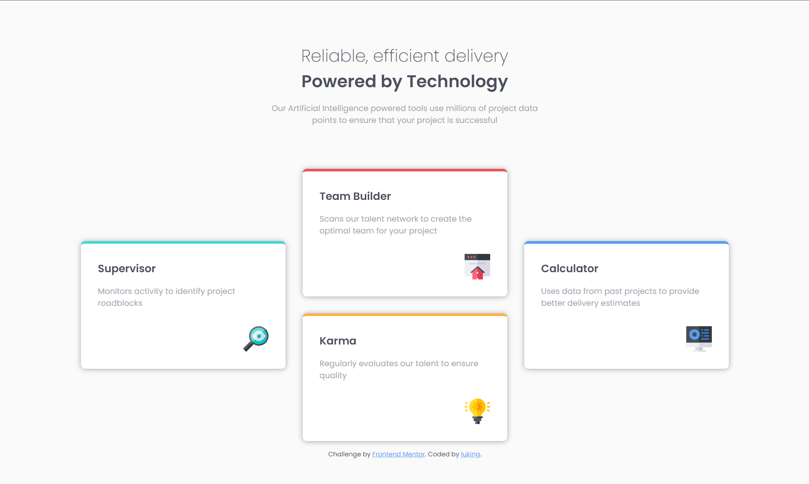

# Frontend Mentor - Four card feature section solution

This is a solution to the [Four card feature section challenge on Frontend Mentor](https://www.frontendmentor.io/challenges/four-card-feature-section-weK1eFYK). Frontend Mentor challenges help you improve your coding skills by building realistic projects. 

## 👀 Overview

### 🚩 The challenge


Users should be able to:

- View the optimal layout for the site depending on their device's screen size


### 📸 Screenshot




### 🏡 Link

- Live Site URL: [Visit Online](https://luking-frontendmentor-challenges.netlify.app/four-card-feature-section/)

## 🚧 My process

### 🔖 Built with

- Semantic HTML5 markup
- CSS custom properties
- CSS Grid
- Mobile-first workflow

### ✍️ What I learned

```css
@media (min-width: 1200px) {
  .grid {
    grid-template-columns: repeat(3, 1fr);
  }
  .card:nth-child(1) {
    grid-row: 1 / 3;
  }
  .card:nth-child(4) {
    grid-row: 1 / 3;
    grid-column: 3 / 4;
  }
}
```

