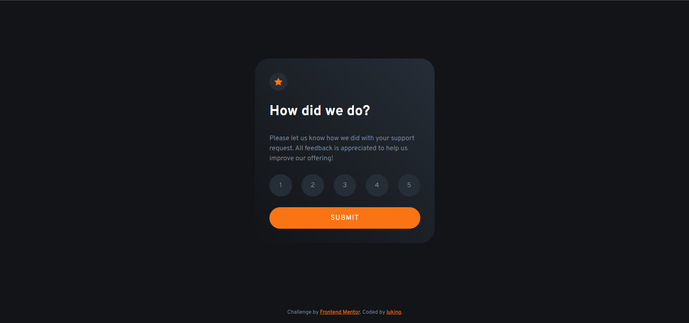

# Frontend Mentor - Interactive rating component solution

This is a solution to the [Interactive rating component challenge on Frontend Mentor](https://www.frontendmentor.io/challenges/interactive-rating-component-koxpeBUmI). Frontend Mentor challenges help you improve your coding skills by building realistic projects. 

## 👀 Overview

### 🚩 The challenge

Users should be able to:

- View the optimal layout for the app depending on their device's screen size
- See hover states for all interactive elements on the page
- Select and submit a number rating
- See the "Thank you" card state after submitting a rating

### 📸 Screenshot




### 🏡 Link

- Live Site URL: [Visit Online](https://luking-frontendmentor-challenges.netlify.app/interactive-rating-component/)

## 🚧 My process

### 🔖 Built with

- Semantic HTML5 markup
- CSS custom properties
- Flexbox
- CSS Grid
- Mobile-first workflow

### ✍️ What I learned
```html
<!-- how to write a radio groups -->
<form class="rating__form">
  <div class="flex-group">
    <div class="rating__radio">
      <input type="radio" id="score-1" name="rating" value="1" />
      <label for="score-1">1</label>
    </div>
    <div class="rating__radio">
      <input type="radio" id="score-2" name="rating" value="2" />
      <label for="score-2">2</label>
    </div>
    <div class="rating__radio">
      <input type="radio" id="score-3" name="rating" value="3" />
      <label for="score-3">3</label>
    </div>
    <div class="rating__radio">
      <input type="radio" id="score-4" name="rating" value="4" />
      <label for="score-4">4</label>
    </div>
    <div class="rating__radio">
      <input type="radio" id="score-5" name="rating" value="5" />
      <label for="score-5">5</label>
    </div>
  </div>
  <button type="submit" class="button">Submit</button>
</form>
```

```css
/* selector ~ :checked */
.rating__radio input:checked ~ label {
  background-color: var(--clr-primary);
  color: var(--clr-neutral-400);
}
```

```js
// submit event
ratingForm.addEventListener("submit", (e) => {
  e.preventDefault();  
});
```

### 🔗 Useful resources

- [radio input](https://developer.mozilla.org/en-US/docs/Web/HTML/Element/input/radio)