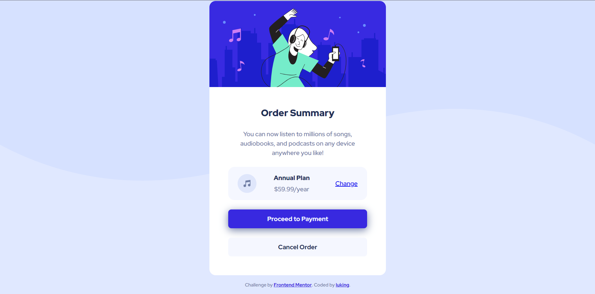

# Frontend Mentor - Order summary card solution

This is a solution to the [Order summary card challenge on Frontend Mentor](https://www.frontendmentor.io/challenges/order-summary-component-QlPmajDUj). Frontend Mentor challenges help you improve your coding skills by building realistic projects.  

## 👀 Overview

### 🚩 The challenge

Users should be able to:

- See hover states for interactive elements

### 📸 Screenshot

### 🏡 Link

- Live Site URL: [Visit Online](https://luking-frontendmentor-challenges.netlify.app/order-summary-card-component/)

## 🚧 My process

### 🔖 Built with

- Semantic HTML5 markup
- CSS custom properties
- Flexbox
- CSS Grid
- Mobile-first workflow

