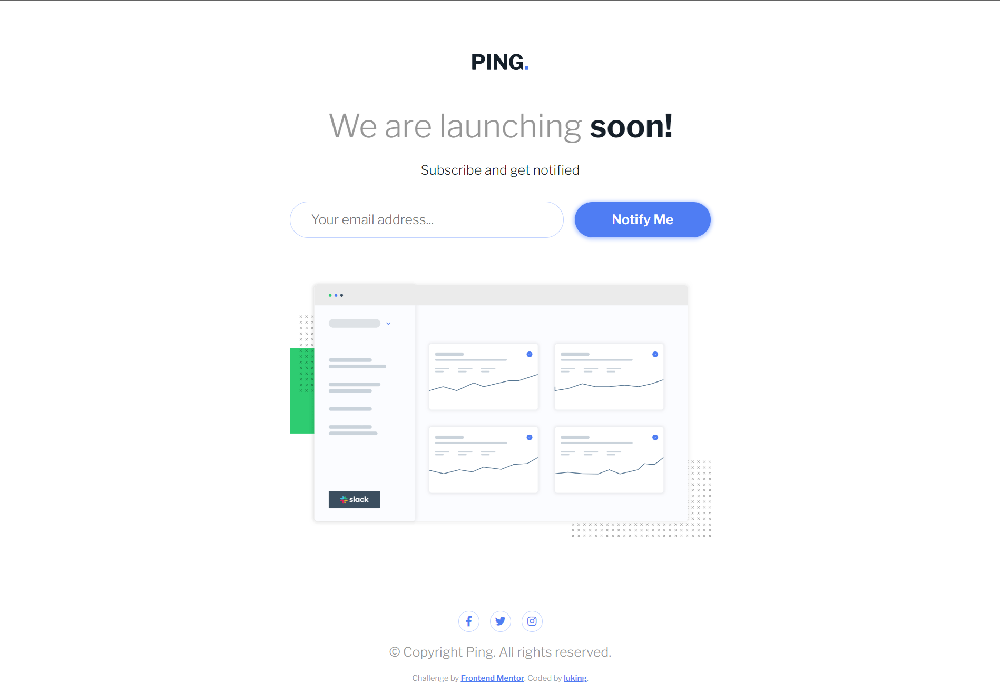

# Frontend Mentor - Ping coming soon page solution

This is a solution to the [Ping coming soon page challenge on Frontend Mentor](https://www.frontendmentor.io/challenges/ping-single-column-coming-soon-page-5cadd051fec04111f7b848da). Frontend Mentor challenges help you improve your coding skills by building realistic projects. 

## 👀 Overview

### 🚩 The challenge

Users should be able to:

- View the optimal layout for the site depending on their device's screen size
- See hover states for all interactive elements on the page
- Submit their email address using an `input` field
- Receive an error message when the `form` is submitted if:
	- The `input` field is empty. The message for this error should say *"Whoops! It looks like you forgot to add your email"*
	- The email address is not formatted correctly (i.e. a correct email address should have this structure: `name@host.tld`). The message for this error should say *"Please provide a valid email address"*

### 📸 Screenshot




### 🏡 Link

- Live Site URL: [Visit Online](https://luking-frontendmentor-challenges.netlify.app/ping-coming-soon-page/)

## 🚧 My process

### 🔖 Built with

- Semantic HTML5 markup
- CSS custom properties
- Flexbox
- CSS Grid
- Mobile-first workflow

### ✍️ What I learned
```html
<input
	type="email"
	name="email"
	id="email"
	pattern="[A-Za-z0-9._%+-]+@[A-Za-z0-9.-]+\.[a-z]{2,4}$"
	placeholder="Your email address..."
	required
/>
```

```css
#email:valid {}

#email:invalid {}

#email:focus-visible {}

.form-control:has(:focus-visible:invalid)::after {}
```

### 🔗 Useful resources

- [:invalid](https://developer.mozilla.org/en-US/docs/Web/CSS/:invalid) 
- [pattern attribute](https://developer.mozilla.org/en-US/docs/Web/HTML/Attributes/pattern)
- [Jhey form:has](https://codepen.io/jh3y/pen/yLKMOBm?editors=1100) - Amazing!
- [labeling controls](https://www.w3.org/WAI/tutorials/forms/labels/)

