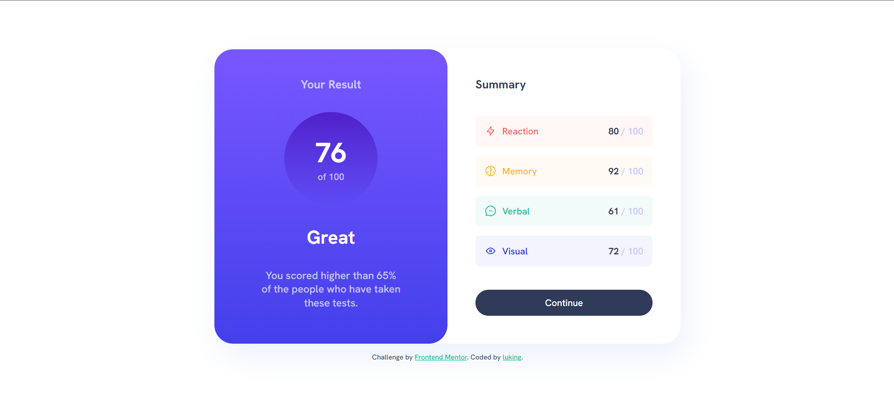

# Frontend Mentor - Results summary component solution

This is a solution to the [Results summary component challenge on Frontend Mentor](https://www.frontendmentor.io/challenges/results-summary-component-CE_K6s0maV). Frontend Mentor challenges help you improve your coding skills by building realistic projects. 

## 👀 Overview

### 🚩 The challenge


- View the optimal layout for the interface depending on their device's screen size
- See hover and focus states for all interactive elements on the page

### 📸 Screenshot




### 🏡 Link

- Live Site URL: [Visit Online](https://luking-frontendmentor-challenges.netlify.app/results-summary-component/)

## 🚧 My process

### 🔖 Built with

- Semantic HTML5 markup
- CSS custom properties
- Flexbox
- CSS Grid
- Mobile-first workflow

### ✍️ What I learned

```css
/* define fonts */
@font-face {
  font-family: "Hanken Grotesk";
  src: url(./assets/fonts/HankenGrotesk-VariableFont_wght.ttf);
  font-weight: 500 800;
}
```


