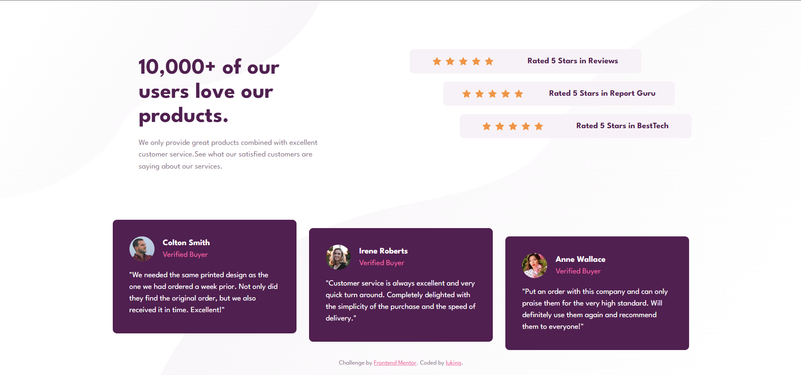

# Frontend Mentor - Social proof section solution

This is a solution to the [Social proof section challenge on Frontend Mentor](https://www.frontendmentor.io/challenges/social-proof-section-6e0qTv_bA). Frontend Mentor challenges help you improve your coding skills by building realistic projects. 

## 👀 Overview

### 🚩 The challenge


Users should be able to:

- View the optimal layout for the section depending on their device's screen size


### 📸 Screenshot




### 🏡 Link

- Live Site URL: [Visit Online](https://luking-frontendmentor-challenges.netlify.app/social-proof-section/)

## 🚧 My process

### 🔖 Built with

- Semantic HTML5 markup
- CSS custom properties
- Flexbox
- CSS Grid
- Mobile-first workflow

### ✍️ What I learned

```css
body {
  background-image: url(./images/bg-pattern-top-desktop.svg),
      url(./images/bg-pattern-bottom-desktop.svg);
  background-position: left top, right bottom;

  background-size: 40vw, 80vw;
}
```


