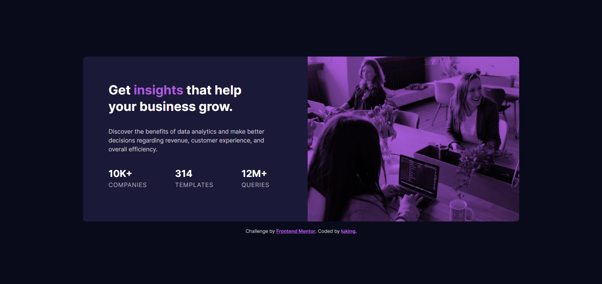

# Frontend Mentor - Stats preview card component solution

This is a solution to the [Stats preview card component challenge on Frontend Mentor](https://www.frontendmentor.io/challenges/stats-preview-card-component-8JqbgoU62). Frontend Mentor challenges help you improve your coding skills by building realistic projects. 

## 👀 Overview

### 🚩 The challenge

Users should be able to:

- View the optimal layout depending on their device's screen size

### 📸 Screenshot




### 🏡 Link

- Live Site URL: [Visit Online](https://luking-frontendmentor-challenges.netlify.app/stats-preview-card-component/)

## 🚧 My process

### 🔖 Built with

- Semantic HTML5 markup
- CSS custom properties
- Flexbox
- CSS Grid
- Mobile-first workflow

### ✍️ What I learned

```css
.card__img {
  min-height: 240px;
  background-color: var(--clr-secondary);
  background-image: url(./images/image-header-desktop.jpg);
  background-size: cover;
  background-blend-mode: multiply;
}
```

```css
.card {
  --content-padding: 2rem;
  --content-spacing: 2rem;
  --content-align: center;
  --max-size: 400px;
}
```


```css
@media (min-width: 1200px) {
  .card {
    --content-padding: 4rem;
    --content-align: left;
    --max-size: 1100px;

    grid-template-columns: 1fr 1fr;
    grid-template-areas: "left right";
    gap: 2rem;
  }

  .card__img {
    grid-area: right;
  }

  .card__content {
    grid-area: left;
  }
}
```

